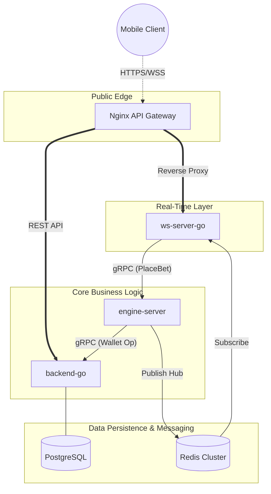
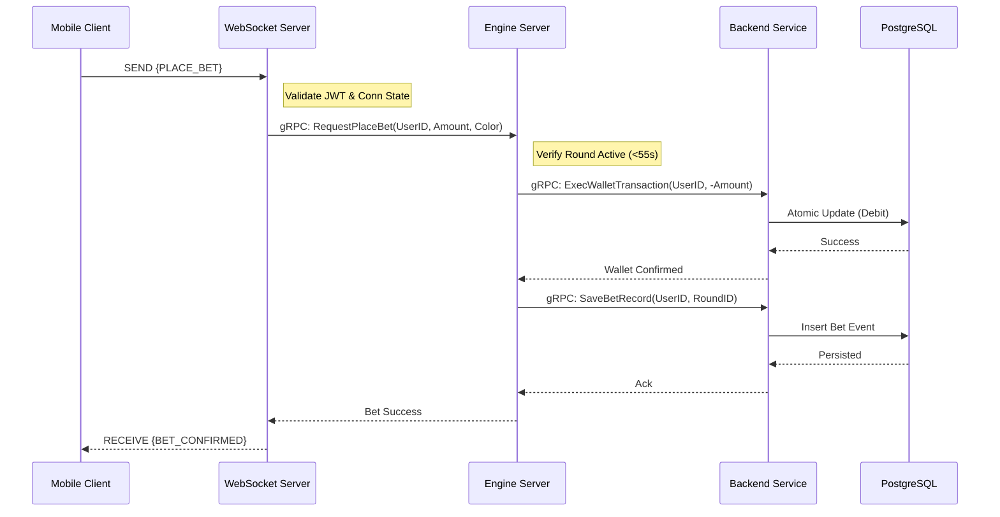

#  Color Trading Infrastructure — High-Performance Microservices

A state-of-the-art, real-time color trading platform engineered for sub-millisecond execution, massive scale, and industrial-grade security. This project implements a sophisticated microservice mesh using **Go (Golang)**, **gRPC**, **Redis Pub/Sub**, and **PostgreSQL**.

---

##  System Architecture

The ecosystem is partitioned into specialized services to ensure maximum isolation, fault tolerance, and horizontal scalability.



### Original Architecture Flow (ASCII)
```text
                          ┌─────────────────────────────────────────────────────────┐
                          │                      CLIENT (Android App)                │
                          └────────────────────────────┬────────────────────────────┘
                                                       │
                                               HTTP / WebSocket
                                                        │
                          ┌────────────────────────────▼────────────────────────────┐
                          │                       NGINX  (:8085)                    │
                          │                      API Gateway                        │
                          │     • Rate Limiting: 10 req/s per IP (burst: 20)        │
                          │     • Internal Secret Header Injection                  │
                          │     • Routes /api  → backend-go  (:8080)                │
                          │     • Routes /ws   → ws-server-go (:8090)               │
                          └────────────┬──────────────────────────┬─────────────────┘
                                       │                          │
                               HTTP REST API                  WebSocket
                                       │                          │
               ┌───────────────────────▼──────┐    ┌─────────────▼───────────────────┐
               │         backend-go (:8080)   │    │      ws-server-go (:8090)       │
               │       REST API Server        │    │      WebSocket Server           │
               │                              │    │                                 │
               │  • /api/v1/auth/*            │    │  • JWT auth via query token     │
               │  • /api/v1/wallet/*  (auth)  │    │  • BroadcastMessage to clients  │
               │  • /api/v1/bets/*    (auth)  │    │  • PlaceBet via gRPC →          │
               │  • /api/v1/transactions/*    │    │    engine-server                │
               │                              │    │                                 │
               │  Middleware:                 │    │  Subscribes to Redis:           │
               │  • JWT Auth                  │    │  • "game_updates" channel       │
               │  • Internal Secret Check     │    │                                 │
               │                              │    └───────┬──────────────┬──────────┘
               │  gRPC Server (:8082):        │            │              │
               │  • PlaceBet                  │            │ gRPC         │ Redis Sub
               │  • SaveBet                   │            │              │
               │  • CreditAmount              │            ▼              ▼
               │  • SaveRoundResult           │    ┌───────────────┐ ┌───────────────┐
               │  • UpdateBetResult           │    │ engine-server │ │     Redis     │
               │  • CreateRound               │◄───┤    (:8083)    │ │    (:6379)    │
               │  • UpdateRoundStatus         │gRPC│  Game Engine  ├─► Pub: updates  │
               └───────────────┬──────────────┘    │               │ │ recent_rounds │
                               │                   │  Game Loop    │ │ current_round │
                          PostgreSQL               │  Handles Bets │ └───────────────┘
                           (:5432)                 │  Settles Wins │
                                                   └───────────────┘
```

---

##  Architecture Flow: End-to-End Bet Execution
The following sequence illustrates the high-speed orchestration between microservices during a live betting event.



---

##  Performance & Concurrency Pillars

###  Ultra-Fast Concurrency
*   **Settlement Worker Pool:** On round completion, the Engine leverages a specialized pool of **20 concurrent goroutines**. This enables parallel settlement of thousands of bets in milliseconds, ensuring users see their winnings instantly.
*   **Non-Blocking Pub/Sub:** Real-time state (timer ticks, results) is broadcasted via Redis Pub/Sub. The WebSocket server consumes these events asynchronously, preventing bottlenecks even with massive user concurrency.

###  Safety & Integrity
The system implements a zero-trust architecture where security is enforced at every hop.

####  Intelligent Rate Limiting
Nginx acts as a traffic warden, preventing brute-force attacks and API abuse using precise rate-limiting zones.
*   **Threshold:** 10 requests per second per IP.
*   **Burst:** Up to 20 requests allowed before throttling kicks in.

```nginx
# Nginx Rate Limiting Implementation
http {
    limit_req_zone $binary_remote_addr zone=api_limit:10m rate=10r/s;
    
    server {
        location /api {
            limit_req zone=api_limit burst=20;
            proxy_pass http://backend-go:8080;
        }
    }
}
```

####  Internal Secret Injection
To prevent users from bypassing Nginx and hitting microservices directly, Nginx injects a cryptographic **X-Internal-Secret** header. Services reject any request that lacks this secret, ensuring that the API Gateway is the **only** entry point.

#### Advanced Concurrency in Go
*  **Worker Pools:** On round completion, the Engine leverages a specialized pool of **20 concurrent goroutines**. This enables parallel settlement of thousands of bets in milliseconds, ensuring users see their winnings instantly.
*   **Non-Blocking Pub/Sub:** Real-time state (timer ticks, results) is broadcasted via Redis Pub/Sub. The WebSocket server consumes these events asynchronously, preventing bottlenecks even with massive user concurrency.

####  Data Integrity
*   **gRPC Contracts:** All internal communication is strictly typed using Protocol Buffers. This prevents data corruption and provides a 10x performance boost over traditional HTTP/JSON.
*   **Atomic Persistence:** All financial operations (credits/debits) are executed within strict SQL transactions to ensure eventual consistency and zero data loss.

---

##  Infrastructure Stack

| Component | Technology | Primary Role |
| :--- | :--- | :--- |
| **Runtime** | Go 1.22+ | High-throughput service execution |
| **Inter-Service**| gRPC + Protobuf | Low-latency, binary RPC communication |
| **Real-Time** | Redis Pub/Sub | Cross-service event synchronization |
| **Database** | PostgreSQL | Relationally-sound financial persistence |
| **Messaging** | WebSockets | Persistent bi-directional client delivery |
| **Gateway** | Nginx | Security, Rate-Limiting & Routing |

---

##  Microservice Directory

*   **`backend-go`**: The source of truth for user accounts, wallets, and transaction history.
*   **`engine-server`**: The heartbeat of the game. Manages round cycles, settlement logic, and result generation.
*   **`ws-server-go`**: Handles live client connections and bridges the internal Redis event bus to the mobile frontend.
*   **`nginx`**: The intelligent entry point ensuring only clean, authenticated traffic reaches the mesh.

---


